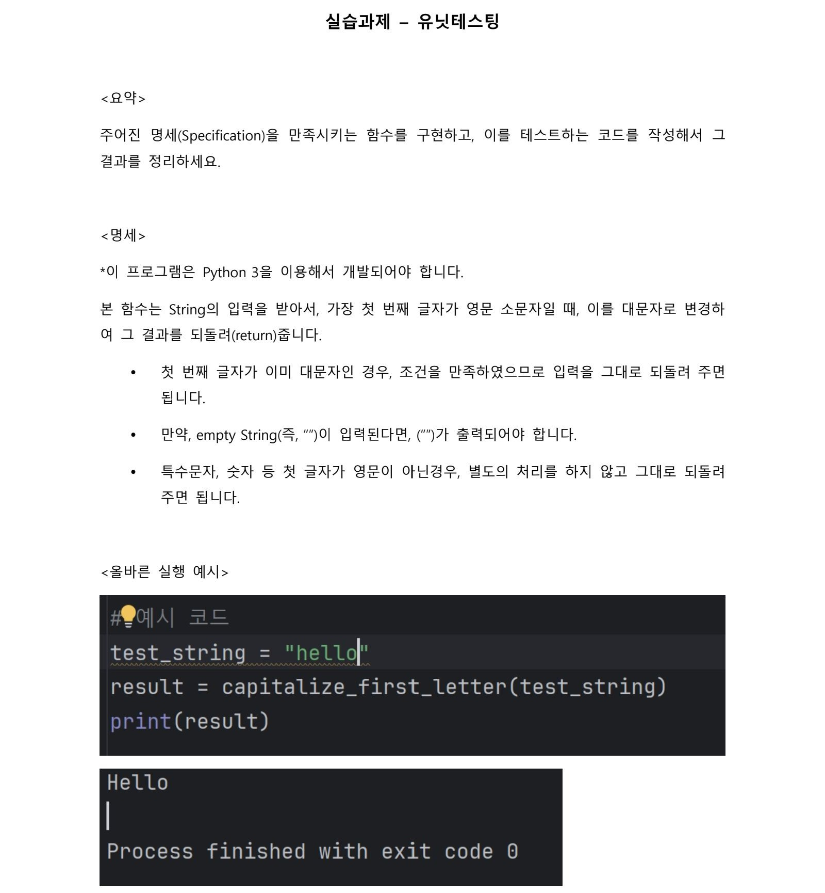
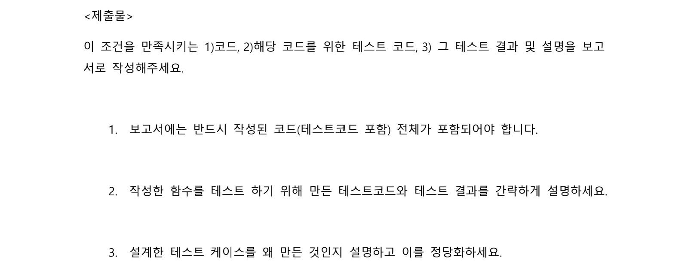
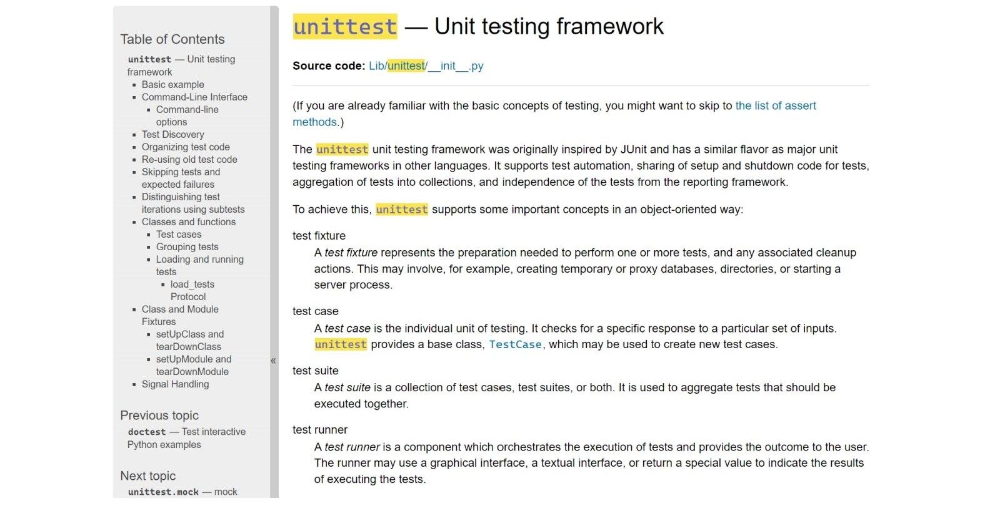
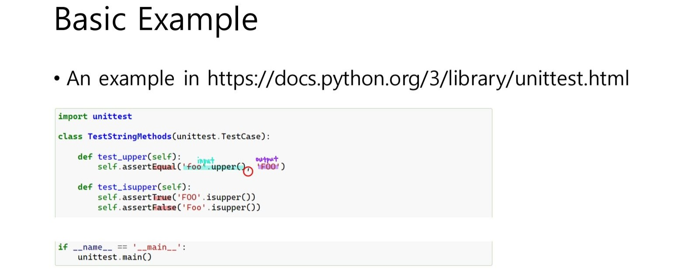
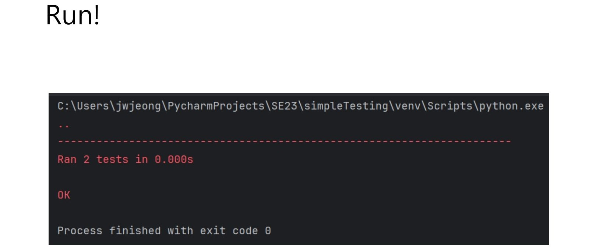
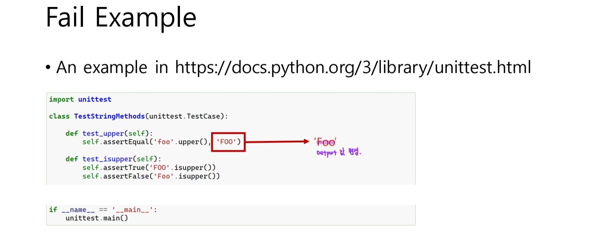
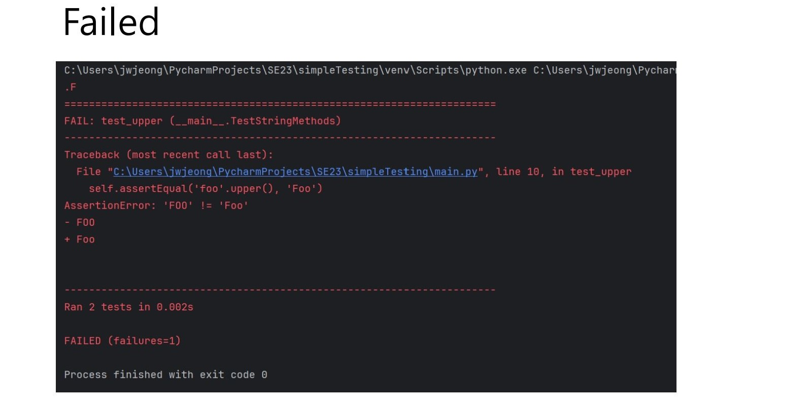
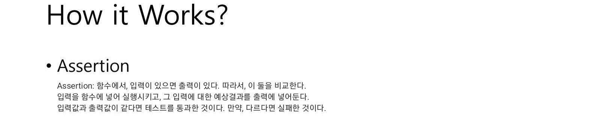
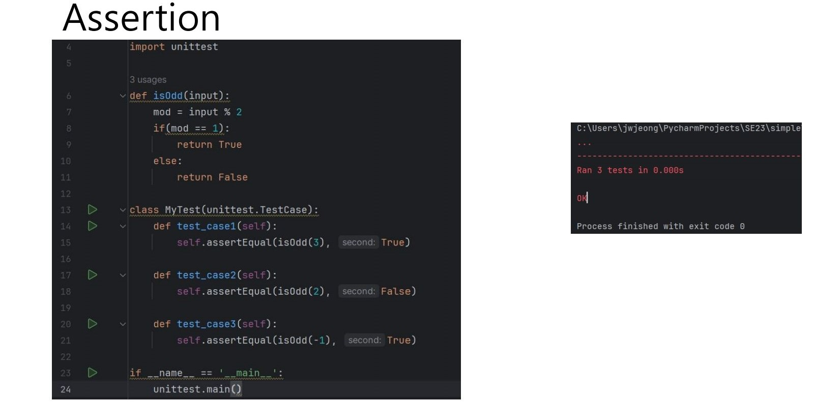
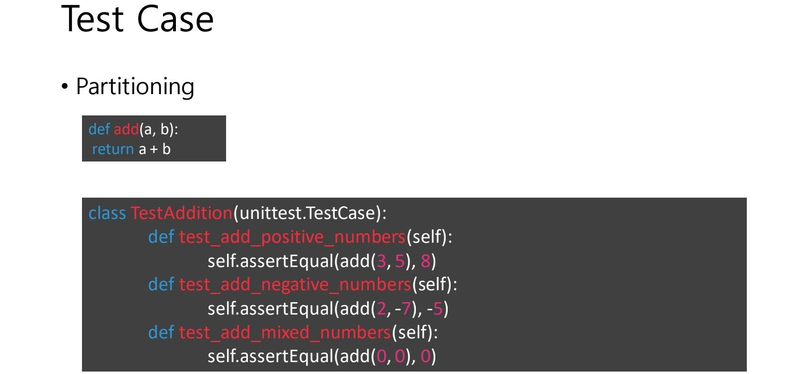

# jbnu-se-solo

2023년. 4학년 1학기. Software Engineering. 소프트웨어공학.

## 1. Development

### 1-1. Summary

수업 간 소프트웨어공학 과제 [소스 코드](/src) 및 [레포트](/docs/report.pdf) 모음.

Python Unittest Framework를 이용한 TDD(Test Driven Development) 기반 개발.

여기서는 `capitalize_first_letter()` 메소드(함수)에 대한 Unit Testing 구현.

### 1-2. Environment

Python3

### 1-3. Detailed

